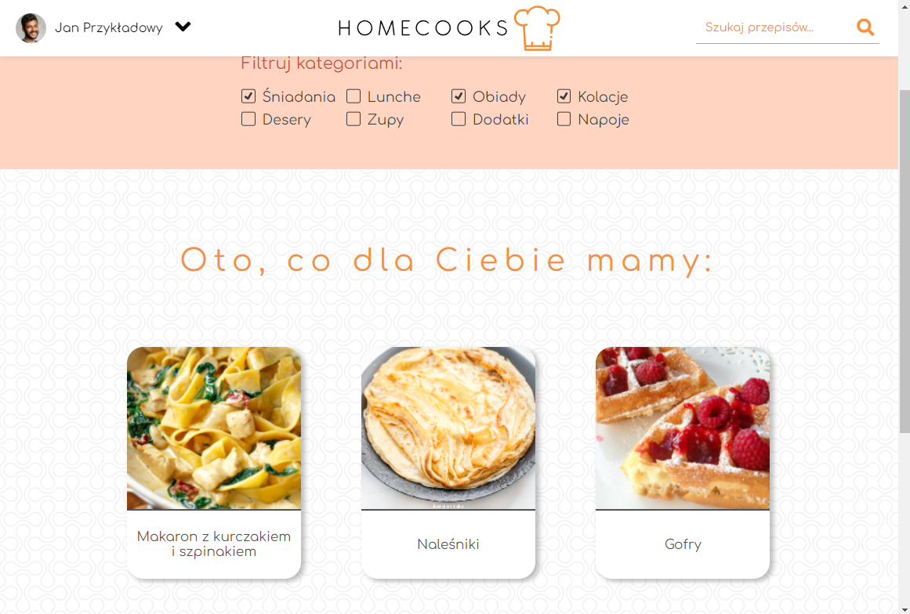

# Homecooks.com 

Final project for "Introduction to web application programming" laboratory on Cracov University of Technology.

## Technology stack
* HTML
* CSS w/o preprocessors
* JavaScript w/o frameworks
* PostgreSQL
* PHP

## Preview

## Functionalities
* Creating accounts, user authentication, session, password hashing etc. 
* Adding recipes with a reactive section for ingredients (you can pick some from db or create new ones)
* Displaying recipes (newest on the landing page, all of them on recipes page)
* Filtering recipes
* Quite nice looking UI which you can see on the preview :)